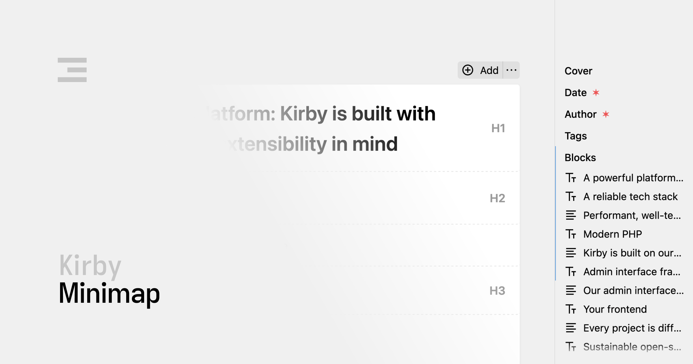

# Kirby Minimap

A sidebar navigation for the Kirby Panel that provides a structured overview of all fields and blocks in the current Panel view.

This is especially useful when working with complex page designs that contain many fields or long block fields. The minimap displays a compact navigation sidebar that highlights the current position in the content editor and allows you to quickly jump to any field or block.

## Features

- 🧭 **Field Navigation**: Click on any field or block to scroll to that position in the content editor
- 📯 **Block Preview**: For block fields, the minimap shows each block with its type icon and content preview
- 🔆 **Automatic Highlighting**: The minimap automatically highlights your current position as you scroll through the Panel view

## Requirements

- Kirby 4 or Kirby 5

Kirby is not free software. However, you can try Kirby and the Starterkit on your local machine or on a test server as long as you need to make sure it is the right tool for your next project. … and when you're convinced, [buy your license](https://getkirby.com/buy).

## Installation

### Composer

```bash
composer require johannschopplich/kirby-minimap
```

### Download

Download and copy this repository to `/site/plugins/kirby-minimap`.

## Getting Started

Once installed, the minimap will automatically appear on the right side of your Panel when editing content. The minimap has two states:

1. **Collapsed** - Shows only a thin vertical line with markers for each field
2. **Expanded** - Shows the full minimap with field names and block details

You can toggle between these states by clicking the arrow button at the top of the minimap.

> [!NOTE]
> Fields with `type: hidden` will not be shown in the minimap.

## License

[MIT](./LICENSE) License © 2025-PRESENT [Johann Schopplich](https://github.com/johannschopplich)
